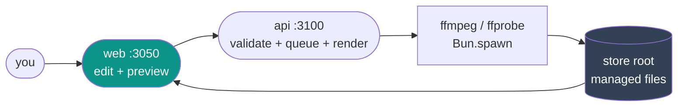
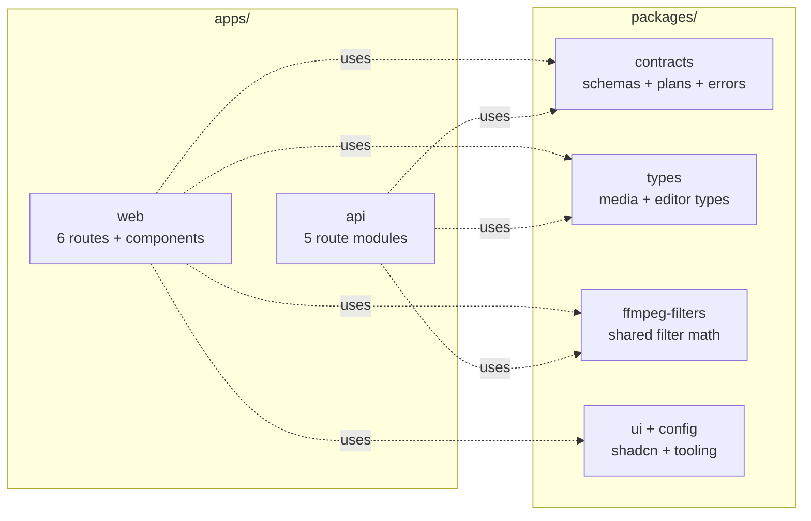
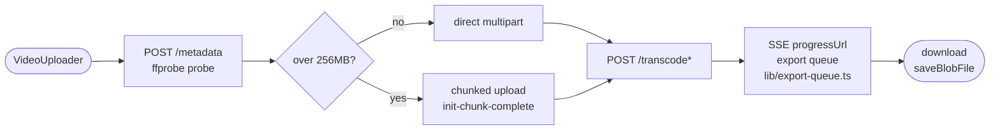
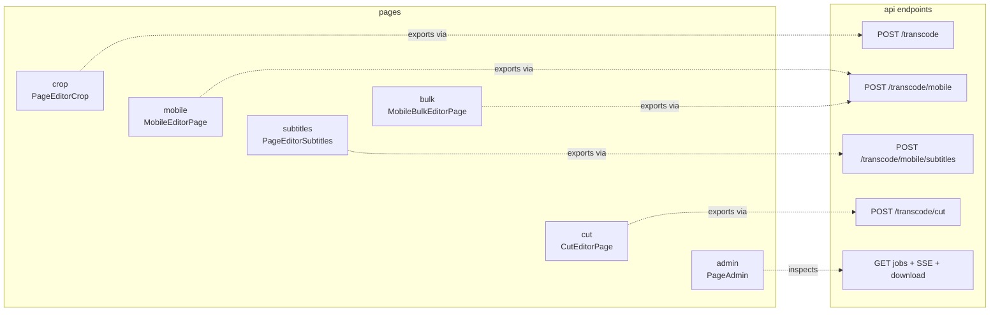
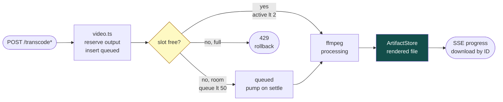

# FFmpeg Editor

Local-only video editor — trim, crop, reframe 16:9 → 9:16, burn subtitles,
batch-convert folders. Next.js frontend, Hono API on Bun, local
`ffmpeg`/`ffprobe`. **100% local:** videos never leave your machine.

| App | Command | URL |
|---|---|---|
| `apps/web` | `next dev -p 3050` | http://localhost:3050 |
| `apps/api` | `bun run --watch src/index.ts` | http://localhost:3100 |

```bash
bun install
bunx turbo dev   # both apps in parallel
```

Deep dives: `apps/web/README.md` (pages + components), `apps/api/README.md`
(endpoints + storage + queue), `apps/web/AGENTS.md` + `apps/api/AGENTS.md`
(agent briefs).

## 1. Big picture



- Web previews everything live in the browser (canvas/CSS) — the server
  renders only on export.
- API owns jobs, files, and the ffmpeg queue. Paths never leave the server;
  clients see opaque `ast_…` / `art_…` IDs.
- Details: web §1 (shell + layers), API §1 (request walk-through + module map).

## 2. Monorepo map (same view as the sub-READMEs)



| Package | Single source of truth for |
|---|---|
| `@repo/contracts` | zod settings schemas, render plans (`migrateRenderPlan`), multipart keys (`MULTIPART_FIELDS`, `UPLOAD_ID_*`), error envelope (`ERROR_STATUS`, `classifyFfmpegExit`) |
| `@repo/types` | `TranscodeProgress/Response`, `FFprobeReport`, `MobileLayout/CropZone`, `Subtitle/*`, `CutSegment` |
| `@repo/ffmpeg-filters` | `cropPercentToPixels`/`zoneToPixels`, visual-filter builders — canvas preview and exporter can't drift |
| `@repo/ui` + `@repo/config` | Shadcn primitives, Tailwind/TS/ESLint configs (web-only for `ui`) |

## 3. Frontend → backend: one export, end to end



`uploadId` (`x-upload-id` header / query / multipart field) is reused across
metadata → transcode so 10 GB files upload once. Which page calls what:



Component maps per page: `apps/web/README.md` §2.

## 4. How the backend handles it



- Job rows: `queued → processing → completed | failed | cancelled`
  (`apps/api/README.md` §3). `DELETE` releases files + row; downloads never delete.
- Files: `reserve()` → write → `finalize()` → `share()`/`adopt()` → `release()`
  (`AssetStore` = inputs, `ArtifactStore` = outputs; §5).
- Uploads: `init → chunk* → complete`, random-access 8 MB slices, idempotent
  per index (§4). Audio/metadata probe via `ffprobe`; waveform/extract via `ffmpeg`.

## 5. Pages and API at a glance

Pages (`/` → `/editor/crop`): crop (trim/crop/filters), mobile (9:16 zones),
subtitles (9:16 + burned PNG text), bulk (folder batch), cut (multi-cut),
admin (jobs inspector). Full feature→`ComponentName` maps: `apps/web/README.md` §2.

API (`:3100`, envelope `{ code, message, issues? }`): upload sessions
(`/upload/*`), transcodes (`/transcode`, `/mobile`, `/mobile/subtitles`,
`/cut`), jobs/SSE/download (`/jobs`, `/jobs/stream`, `/progress/:id`,
`/download/:id`), inspect (`/metadata`, `/audio/analysis`, `/audio/extract`),
files (`/storage/stats`, `/files/:id/download`). Full table: `apps/api/README.md` §6.

## 6. Run it

```bash
bun install
bunx turbo dev        # web :3050 + api :3100
bunx turbo build      # production builds
bunx turbo lint       # eslint
NEXT_PUBLIC_API_URL=http://localhost:3100 bunx turbo dev  # point web elsewhere
```

Prereqs: Bun ≥ 1.3, `ffmpeg` + `ffprobe` on `PATH`, 10 GB+ free in the OS temp
dir. Local-only by design — never expose `:3100` publicly.
