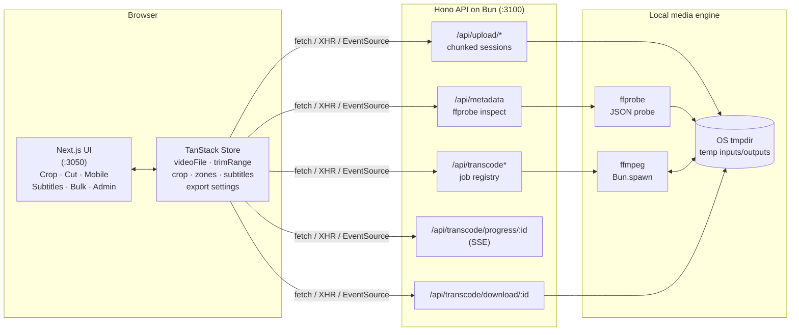
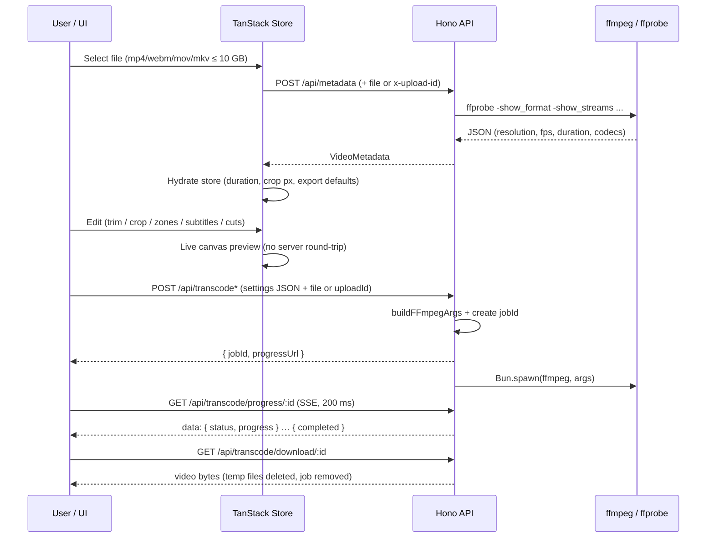
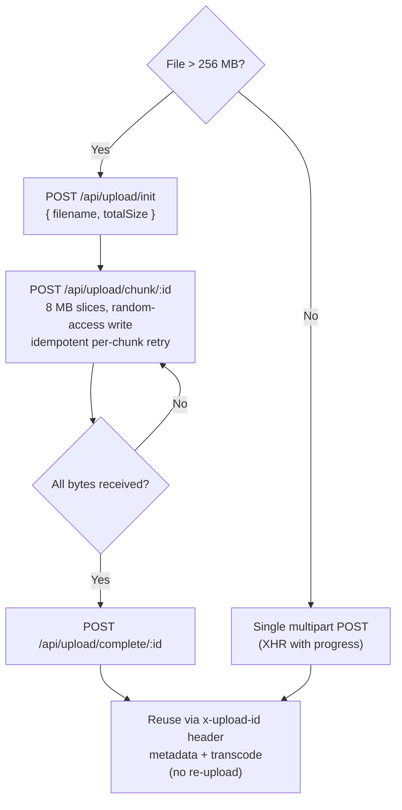
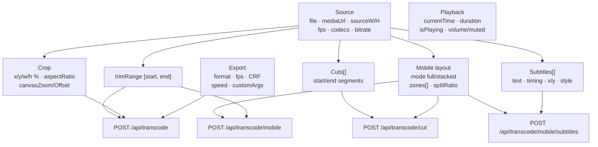

# FFmpeg Editor

Local-only video editor for trimming, cropping, reframing (16:9 → 9:16), subtitling, and batch-converting videos — powered by a Next.js frontend, a Hono API on Bun, and a locally installed `ffmpeg`/`ffprobe`.

- **100% local** — videos never leave your machine; no auth, no cloud, no tracking.
- **Non-destructive editing** — trim, crop, zones, subtitles are previewed live in the browser; `ffmpeg` renders only on export.
- **Large-file friendly** — chunked resumable uploads up to 10 GB, SSE progress streaming, temp files auto-cleaned after download.

## Capabilities

### ✂️ Crop & Trim — `/editor/crop`
- Drag-and-drop import (`mp4` / `webm`) with instant blob-URL preview.
- Interactive timeline with dual trim handles, sub-second time display, playhead, loop-inside-trim.
- Draggable/resizable crop overlay (8 handles, 3×3 grid) with aspect locks (`custom`, `1:1`, `16:9`, `21:9`), canvas zoom (0.25–4×) + pan.
- Live readouts: X/Y %, size %, pixel bounds, and the exact `crop=w:h:x:y` filter string.
- Export panel: format (`mp4` / `webm` / `mov`, default = source), framerate (source / 30 / 60 / custom), CRF quality, playback/export speed, custom filename, raw FFmpeg args textarea.
- Crop presets persisted to `localStorage`; trim range persisted + synced across tabs.

### 🎬 Multi-Cut — `/editor/cut`
- Up to 50 non-overlapping cut segments per video: draggable blocks with edge resize (min 0.2 s), numeric start/end inputs, overlap detection blocking export.
- Preview per-cut or play-all (auto-jumps between segments); total output duration shown.
- Reframe modes: `full-size`, `1-stack`, `2-stack` (9:16 output using the shared Mobile layout zones + split slider + watermark toggle).
- Export fixed at 60 fps / CRF 10 / `mp4`.

### 📱 Mobile Reframe 9:16 — `/editor/mobile`
- Converts landscape 16:9 sources to portrait `1080×1920` for Shorts/Reels/TikTok.
- Zone editor on the source stage: drag to move, corner handles to aspect-locked resize, zoom slider (0.5–3×), lock, and roles (`camera` / `gameplay` / `content`).
- Layouts: `full` (1 zone) or `stacked` (2 zones) with adjustable split ratio + draggable divider.
- Live canvas portrait preview (`requestVideoFrameCallback`, DPR-aware) with safe-area overlay and optional watermark (`minozavr.png`).
- Undo/redo history (50 steps), trim slider + loop + full-length (`ignoreTrim`) toggle, layout preferences saved and shared with Cut/Bulk/Subtitles.
- Live FFmpeg filter-graph string display while editing.

### 🔤 Subtitles on 9:16 — `/editor/mobile/subtitles`
- Styled subtitle tracks composited over the shared 9:16 layout.
- Multi-track timeline: drag to move/resize, vertical drag across tracks, auto free-track placement.
- Per-subtitle text, start/end times, X/Y position (0–100), track assignment.
- Styling: Google Fonts picker (search, hover-preload, Cyrillic badge), size, color, outline / shadow / background toggles with hex inputs; style templates saved to `localStorage`.
- Subtitles are rendered to PNGs client-side and burned in by FFmpeg with frame-accurate timing.

### 📦 Bulk Batch — `/editor/mobile/bulk`
- Pick a whole folder (`webkitdirectory`); each video becomes a queued card with canvas thumbnail, duration, and resolution.
- Applies the saved Mobile stacked layout to every file, full-length, sequentially: `idle → queued → uploading → processing → saving → completed/failed` with per-file progress bars.
- Select all/none, output via directory picker (`showDirectoryPicker`) or browser downloads, watermark toggle.

### 🛠️ Admin / Jobs — `/admin`
- Live job inspector (polls every 1.5 s) with `all / processing / completed / failed` filter.
- Per-job status badge, progress, age, output paths, hung-job detection; delete one, clear pending, clear all, retry.
- Shows API reachability and troubleshooting tips.

### Shared UX
- Animated tab navigation with directional slide transitions (view transitions) and optimistic active state.
- Custom player controls (play/pause, seek slider `MM:SS.ss`, volume, fullscreen), dark/light theme toggle.
- Toasts (Sonner) for export start/finish/errors; save-file picker with sensible default names, anchor-download fallback.
- Full `ffprobe` inspector dialog (format, streams, programs, chapters) from the sidebar.

## Tech Stack

| Layer | Technology |
|---|---|
| Monorepo | Turborepo (`turbo.json`), Bun workspaces (`apps/*`, `packages/*`) |
| Frontend | Next.js 16 (App Router, Turbopack) + React 19 + Tailwind CSS 4 |
| UI kit | shadcn (`packages/ui`), Lucide icons, Kumo design tokens (`@cloudflare/kumo`) |
| Client state | TanStack Store (single `useVideoStore` source of truth) |
| Server state | TanStack Query (metadata/transcode mutations, admin polling) |
| Backend | Hono on Bun (`Bun.serve`, port 3100) |
| Media engine | Local `ffmpeg` via `Bun.spawn` (non-blocking), `ffprobe` for metadata |
| Uploads | Chunked resumable protocol (8 MB chunks, pre-allocated sparse temp files) |
| Progress | Server-Sent Events parsed from FFmpeg `out_time_us/ms` stderr lines |

## Architecture

### System overview



### Export pipeline (upload → render → download)



### Large-file chunked upload



### Editor state model



## API Reference

Base URL: `http://localhost:3100` (override with `NEXT_PUBLIC_API_URL`).

| Method & Path | Purpose |
|---|---|
| `GET /health` | Liveness probe (`status`, `ffmpegPath`) |
| `POST /api/upload/init` | Start chunked session → `{ uploadId, chunkSize }` |
| `POST /api/upload/chunk/:uploadId` | Upload one raw chunk (`x-chunk-index/offset`) |
| `POST /api/upload/complete/:uploadId` | Verify size, finalize session |
| `GET /api/upload/status/:uploadId` | Upload progress `%` |
| `DELETE /api/upload/:uploadId` | Abort session + cleanup |
| `POST /api/metadata` | `ffprobe` inspect (file or `x-upload-id`; optional `?includeFrames&includePackets`) |
| `POST /api/transcode` | Crop/trim export (settings JSON + file/`uploadId`) |
| `POST /api/transcode/cut` | Multi-cut concat export |
| `POST /api/transcode/mobile` | 9:16 stacked/full export |
| `POST /api/transcode/mobile/subtitles` | 9:16 export with burned-in PNG subtitles |
| `GET /api/transcode/progress/:jobId` | SSE stream (`processing %` → `completed`/`failed`) |
| `GET /api/transcode/download/:jobId` | Download result (deletes temp files + job) |
| `GET /api/transcode/jobs` | List jobs (admin) |
| `DELETE /api/transcode/jobs` | Clear jobs (`?status=processing` supported) |
| `DELETE /api/transcode/jobs/:jobId` | Kill + delete one job |
| `POST /api/transcode/clear` | Alias for clearing jobs |

## Getting Started

### Prerequisites

- [Bun](https://bun.com) ≥ 1.3 (repo pins `bun@1.4.0`)
- `ffmpeg` **and** `ffprobe` on `PATH` (verify with `ffmpeg -version && ffprobe -version`)
- 10 GB+ free space in the OS temp dir for large-file workflows

### Install

```bash
bun install
```

### Run (dev)

```bash
bunx turbo dev
```

This starts both workspace apps in parallel (see `turbo.json` `dev` task):

| App | Command | URL |
|---|---|---|
| `apps/web` | `next dev -p 3050` | http://localhost:3050 |
| `apps/api` | `bun run --watch src/index.ts` | http://localhost:3100 |

The home page redirects to `/editor/crop`. The frontend talks to the API at `http://localhost:3100` by default; point it elsewhere with:

```bash
NEXT_PUBLIC_API_URL=http://localhost:3100 bunx turbo dev
```

### Other tasks

```bash
bunx turbo build   # production builds (apps + packages)
bunx turbo lint    # eslint across workspaces
```

On Windows, `run.bat` does `git pull` → `bun install` → opens `http://localhost:3050` → runs `bunx turbo dev`.

## Project Structure

```
ffmpeg_editor/
├── apps/
│   ├── web/                          # Next.js frontend (:3050)
│   │   ├── app/
│   │   │   ├── editor/crop/          # Crop & Trim mode
│   │   │   ├── editor/cut/           # Multi-Cut mode
│   │   │   ├── editor/mobile/        # 9:16 reframe mode
│   │   │   │   ├── bulk/             # Folder batch mode
│   │   │   │   └── subtitles/        # Subtitle compositing mode
│   │   │   ├── admin/                # Job inspector
│   │   │   ├── pageEditor*.tsx       # Mode implementations
│   │   │   └── icon.svg              # App logo / favicon (128×128)
│   │   ├── components/
│   │   │   ├── editor/               # VideoPlayer, Timeline, CropOverlay,
│   │   │   │                         # Sidebar, VideoUploader, MobilePreviewShared…
│   │   │   ├── ui/                   # shadcn primitives (button, slider, dialog…)
│   │   │   └── view-transition/      # AppHeader, AppNav, DirectionalTransition
│   │   ├── store/
│   │   │   ├── useVideoStore.ts      # Global TanStack Store (source of truth)
│   │   │   └── ffmpeg-store.tsx      # Legacy, unused
│   │   ├── hooks/                    # useVideoMetadata, use-ffmpeg-mutations…
│   │   └── lib/                      # api-client, upload-chunked, video-file…
│   └── api/                          # Hono backend on Bun (:3100)
│       └── src/
│           ├── index.ts              # Bun.serve entry (10 GB body limit, CORS *)
│           ├── routes/
│           │   ├── upload.ts         # Chunked upload sessions
│           │   ├── metadata.ts       # ffprobe inspection
│           │   └── video.ts          # Transcode jobs, SSE progress, downloads
│           └── utils/
│               ├── ffmpegBuilder.ts      # Crop/trim/mobile filter graphs
│               ├── cutBuilder.ts         # Multi-cut concat graphs
│               └── mobileSubtitlesBuilder.ts  # Subtitle overlay graphs
├── packages/
│   ├── ui/                           # Shared shadcn components
│   └── config/                       # Shared TS / Tailwind / ESLint configs
├── PLAN.md                           # Original feature plan (all phases complete)
├── turbo.json                        # build / dev / lint pipelines
└── run.bat                           # Windows one-click runner
```

## Notes & Limitations

- **Local-only by design** — CORS is wide open, bodies up to 10 GB, no auth/rate limits. Never expose port 3100 publicly.
- **Render outputs are ephemeral** — transcoded files land in the OS temp dir and are deleted right after download; save the file when the browser prompts.
- **Cut export** is fixed to 60 fps / CRF 10 / `mp4`; Crop/Mobile expose full quality controls.
- **Bulk mode** reads only top-level folder files (subfolders ignored): `mp4` / `webm` / `mov` / `mkv`.
- Browsers cache favicons aggressively — hard-refresh if the tab icon looks stale after changes.
