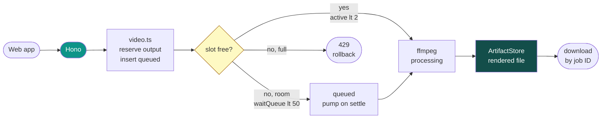
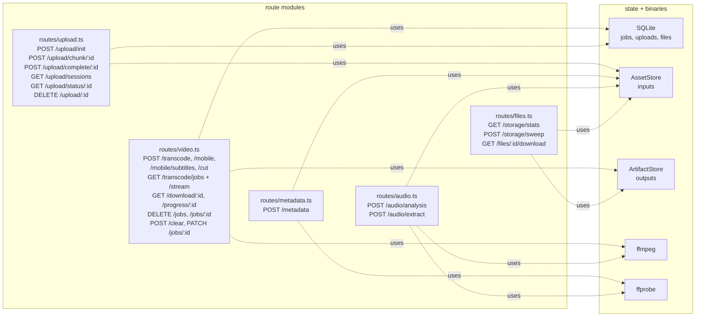
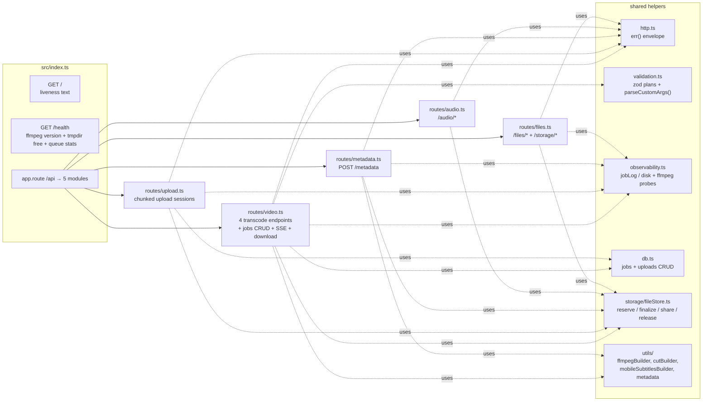
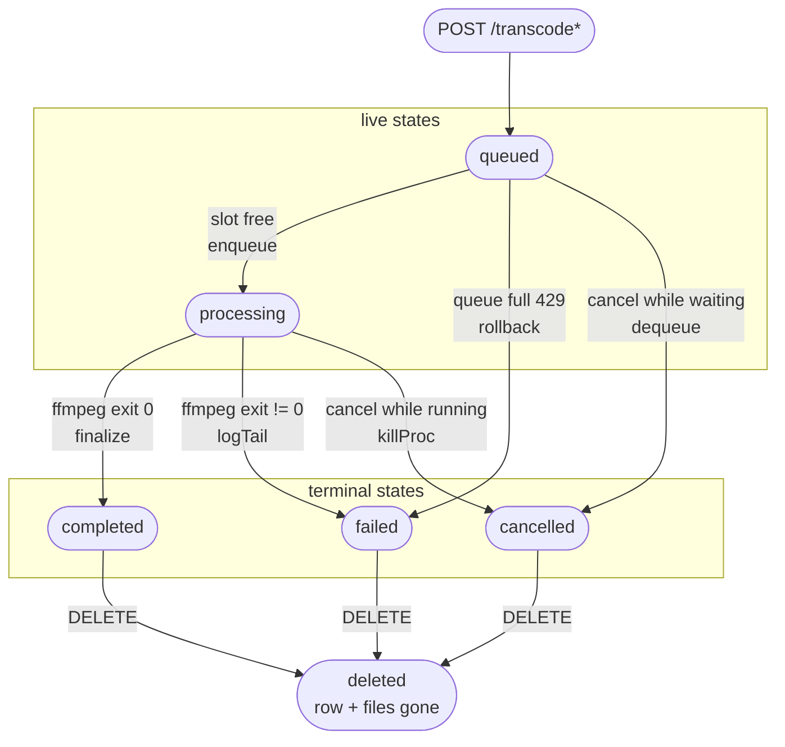
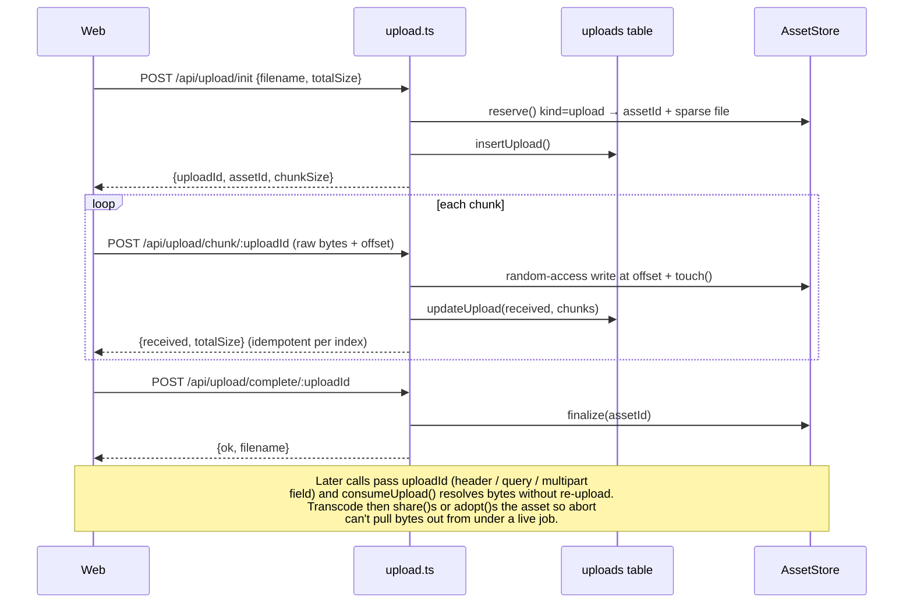
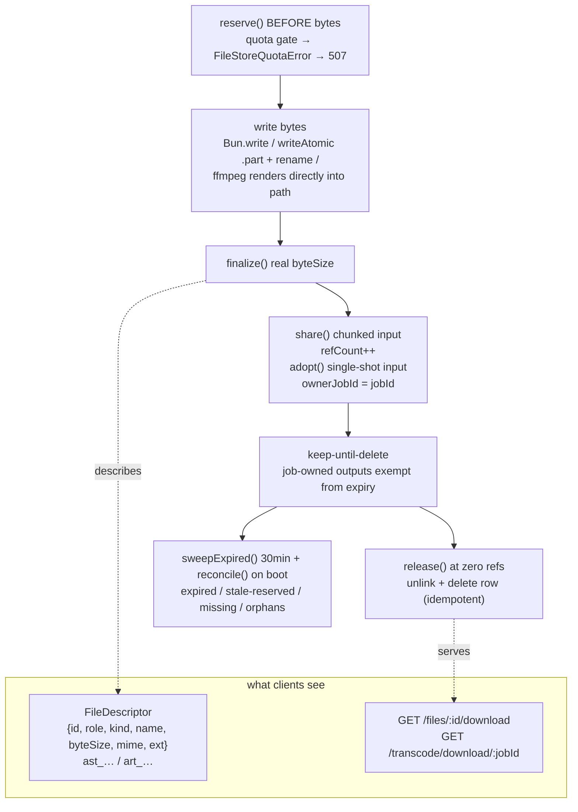

# FFmpeg Editor API (`apps/api`)

Local-only video backend. **Hono on Bun**, **SQLite** (`bun:sqlite`) for persistence,
**`ffmpeg` / `ffprobe`** via `Bun.spawn()` for all media work, and an
**AssetStore / ArtifactStore** (`src/storage/fileStore.ts`) so every temp file
is a tracked DB row — never a stray path in `/tmp`.

- Runtime: `bun run --watch src/index.ts` (default port `3100`)
- Entrypoint: `src/index.ts` → mounts 5 route modules under `/api`
- DB file: `apps/api/.data/app.sqlite` (WAL mode)
- File root: `<os.tmpdir()>/ffmpeg_editor_store/` as `<fileId>.<ext>`
- No auth / CORS / rate limits by design (local app).

## 1. System overview

Instead of one mesh diagram, two views: a request walk-through
(A) and the full module/state map (B). Full state details live in §3.

**A. One transcode request, end to end:**



**B. Modules, state, and binaries in one view:**



## 2. Request routing (where code lives)



## 3. Transcode job lifecycle

Jobs are rows in `jobs`. Happy path is linear: `queued → processing → completed`,
with `failed` / `cancelled` as side exits. `DELETE` removes the row **and**
releases its files. Downloads never delete.



Read-only operations (no state change, so kept out of the diagram above):

- `GET /transcode/progress/:jobId` — SSE every 200ms (+ 15s heartbeat).
  While `queued` it also sends `queuePosition`. Closes on terminal state.
- `GET /transcode/jobs/stream` — SSE every 1s with the full jobs snapshot.
- `GET /transcode/download/:jobId` — streams a `completed` output
  (`200` / `206` Range). Keep-until-delete: downloading never deletes.

Edge → code reference (`src/routes/video.ts`):

- `Submit → queued` — `reserveOutputFile()` + `insertJob(status: queued)`
- `queued → processing` — `enqueue()` / `pumpQueue()` when
  `activeCount < MAX_CONCURRENT`
- `queued → failed` — queue-full 429 or quota 507 → `rollbackQueuedJob()`
- `queued / processing → cancelled` — `DELETE ?mode=cancel` → `dequeue()` /
  `killProc()`, runner no-ops finish
- `processing → completed / failed` — `runTranscode()` /
  `runWebmTgCrfSearch()` → `updateJob()` + `settleJobFiles()`
- `* → deleted` — `hardDeleteJob()` → `releaseJobFiles()` + `deleteJob()` +
  `pumpQueue()`

Bounded queue (`src/routes/video.ts`): `activeCount < MAX_CONCURRENT`
else park in `waitQueue` (max 50). `pumpQueue()` advances on settle.
`GET /transcode/jobs/stream` pushes the full snapshot every 1s for Admin.

## 4. Chunked upload flow (avoids re-uploading 10 GB)



Single-shot alternative: `multipart file` field works on every
`/transcode*`, `/metadata`, `/audio/*` endpoint (record-before-bytes +
`finalize()`, released/moved after use).

## 5. Storage model (why paths never leak)



`AssetStore` = inputs (`upload`, `request-input`, TTL 6h / 1h).
`ArtifactStore` = outputs (`output`, `alternate-output`, `subtitle-png`
keep-until-delete, `ephemeral` TTL 5min). On-disk name is always
`<fileId>.<ext>` (`safeFilename` + `mimeForExt` decide display name / MIME).
`publicJob()` in `video.ts` redacts `<store>` / `<tmp>` out of `error`/`logTail`.

## 6. Endpoints — who does what

Base URL defaults to `http://localhost:3100`. All routes allow CORS `*`
(local-only app, so the web dashboard on `:3050` can poll even the root
ops endpoints `GET /` and `GET /health`). Errors use the shared `{ code, message, issues?, requestId?, jobId? }` envelope
(`src/http.ts` + `@repo/contracts`).

### Ops (`src/index.ts`)

- `GET /` — liveness text (`FFmpeg Editor API is running!`).
- `GET /health` — ops snapshot: `ffmpegVersion`, `tmpdir`,
  `diskFreeBytes/Human`, `queue {active, queued, maxConcurrent, maxQueued}`.
  Failure-tolerant probes.

### Upload sessions (`src/routes/upload.ts`)

- `POST /api/upload/init` — create session: validate `totalSize` (≤10 GB),
  disk + quota gates (507), `AssetStore.reserve()`, pre-allocate sparse file.
  Returns `{uploadId, assetId, chunkSize}`.
- `POST /api/upload/chunk/:uploadId` — random-access write of one raw chunk
  (`x-chunk-index/offset` or query). Idempotent per index, clamps `received`,
  `touch()`es asset.
- `POST /api/upload/complete/:uploadId` — verify/truncate to `totalSize`,
  `finalize()` asset. `UPLOAD_INCOMPLETE` if short.
- `GET /api/upload/sessions` — list open sessions `{count, sessions[]}`
  (newest first: `received/percent/ageSeconds`) for the Admin orphan/abort UI.
- `GET /api/upload/status/:uploadId` — progress
  `{received, totalSize, percent, chunks[], assetId}` — `chunks` is the
  received-index skip-set for client resume.
- `DELETE /api/upload/:uploadId` — abort session. Refcount-aware: jobs holding
  `share()` keep bytes.

### Transcode (`src/routes/video.ts`) — the core

All four `POST`s accept `multipart settings` (v1 `{version, kind, settings}`
or legacy v0, migrated via `migrateRenderPlan`) + `file` **or** `uploadId`
(header `x-upload-id` / query / multipart field). All reserve the output
**before** spawning ffmpeg, `claimInputAsset()`, then `enqueue()` (429 +
`Retry-After: 10` when full).

- `POST /api/transcode` — generic export: trim/crop/fps/crf/format
  (`mp4|webm|mov|webm-tg|gif`), visual filters, audio tracks/gain/loudnorm/
  fades/mutes, watermark, `customFFmpegArgs`. `webm-tg` = strict Telegram preset
  with iterative CRF search to fit `TELEGRAM_WEBM_TG_TARGET_BYTES`.
  `exportSpeed != 1` adds a second (alternate-output) pass in the same worker
  slot.
- `POST /api/transcode/mobile` — 16:9 → 9:16 (`1080×1920`) stacked/full export.
  Rejects non-default `visualFilters` and `-vf` (owns `filter_complex`).
  Fixed `fps 60, crf 10`.
- `POST /api/transcode/mobile/subtitles` — mobile export + burned PNG overlays
  (`subtitles`/`subtitlesMeta` JSON + `subtitle_0…N` files). Count-mismatch →
  `SUBTITLES_INVALID`. PNGs are job-owned artifacts.
- `POST /api/transcode/cut` — multi-cut assembly
  (`mode: full-size|stacked…`, non-overlapping cuts, zones). Duration =
  `totalCutDuration(cuts)`.
- `GET /api/transcode/jobs` — list all jobs (newest first) as public shapes +
  `queuePosition`, `ageSeconds`, queue stats. No paths leak.
- `GET /api/transcode/jobs/stream` — SSE (1s) full-jobs snapshot for Admin
  dashboard (replaces polling).
- `GET /api/transcode/progress/:jobId` — SSE (200ms + 15s heartbeat) for one
  job; closes on terminal state
  (`completed|failed|cancelled` with `error, logTail, exitCode`).
- `GET /api/transcode/download/:jobId` — stream completed output (`200` or
  `206` single-range, `Content-Length`, correct MIME). Download ≠ delete.
- `DELETE /api/transcode/jobs` — bulk clear (`?status=` filter). Kills ffmpeg,
  releases files, deletes rows, then `store.reconcile()` + legacy `/tmp` sweep
  when clearing all.
- `POST /api/transcode/clear` — alias of the above (JSON `{status}` or query).
- `DELETE /api/transcode/jobs/:jobId` — hard delete (kill + release + row).
  With `?mode=cancel`: cooperative cancel — kill ffmpeg but **keep** row/files
  for log inspection.
- `PATCH /api/transcode/jobs/:jobId` — rename export (`{filename}`, ≤128 chars,
  sanitized).

### Inspect (`src/routes/metadata.ts`)

- `POST /api/metadata` — `ffprobe -show_format/streams/...` → parsed summary
  (`durationSeconds, width/height, frameRate, codecs, bitrateKbps` + full
  report). Reuses `uploadId` or single-shot file (released after probe).
  `?includeFrames=true&includePackets=true` for deep dumps (ffprobe ≥6 merges
  both into `packets_and_frames`; `splitPacketsAndFrames` in `utils/metadata.ts`
  splits it back into `frames[]`/`packets[]`). `FFPROBE_FAILED` (422) vs
  `UNSUPPORTED_MEDIA` (no video stream) vs `INTERNAL` (spawn failed).

### Audio (`src/routes/audio.ts`)

- `POST /api/audio/analysis` — per-track inspect + 2400-bucket `peaks`/`rms`
  waveform (8 kHz mono `f32le`) + `loudnorm` LUFS report. `?track=N` selects
  audio stream. Single-shot asset released after; chunked inputs read in place.
- `POST /api/audio/extract` — demux one track to
  `?format=mp3 (libmp3lame q2) | wav (pcm_s16le)`. Renders to an `ephemeral`
  artifact, streams it, then releases.

### Files (`src/routes/files.ts`)

- `GET /api/storage/stats` — store census
  `{files, bytes, quotaBytes, byRole, byKind}`.
- `POST /api/storage/sweep` — on-demand `store.reconcile()` (pins live
  uploads): reaps expired/stale-reserved/missing/orphan rows, returns
  `{expired, staleReserved, missing, orphans, bytesFreed}`. Live jobs untouched;
  idempotent.
- `GET /api/files/:id/download` — download any asset/artifact by opaque ID
  (`ast_…`/`art_…`) with `206` range support. Unknown/deleted → 404. Same
  `streamFile()` helper the job download uses.

## 7. Local development

```bash
cd apps/api
bun install
bun run dev      # watch mode, PORT=3100 (Bun.serve, 10 GB max body, 255s idle)
bun test         # bun test
bun run lint     # tsc --noEmit
```

Boot sequence: `startupSweep()` (fail interrupted jobs, drop partial outputs,
purge stale uploads/orphan temps) → `store.reconcile()` (expired /
stale-reserved / missing / orphans, live uploads pinned) → log ffmpeg version

- tmpdir headroom. Structured logs: `[api]`, `[job <id>]`, `[upload <id>]`.
