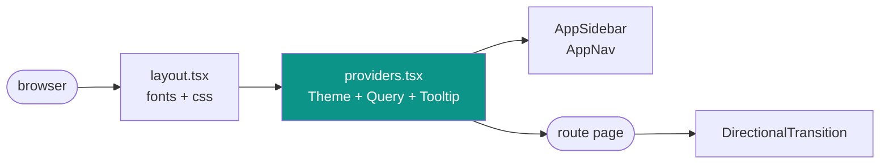
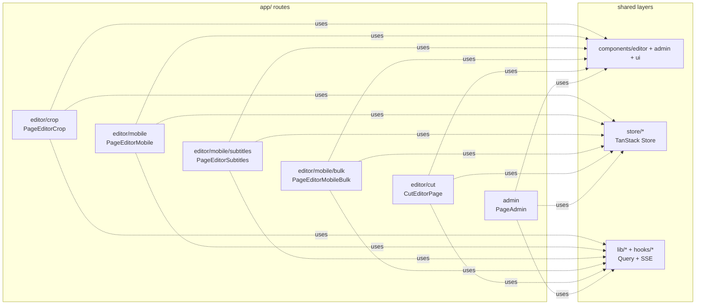
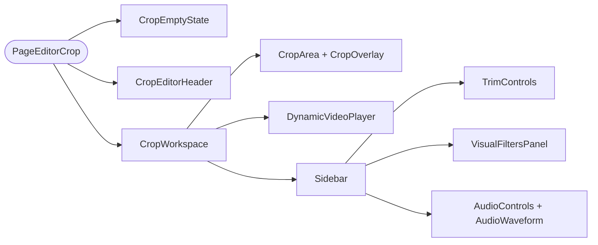
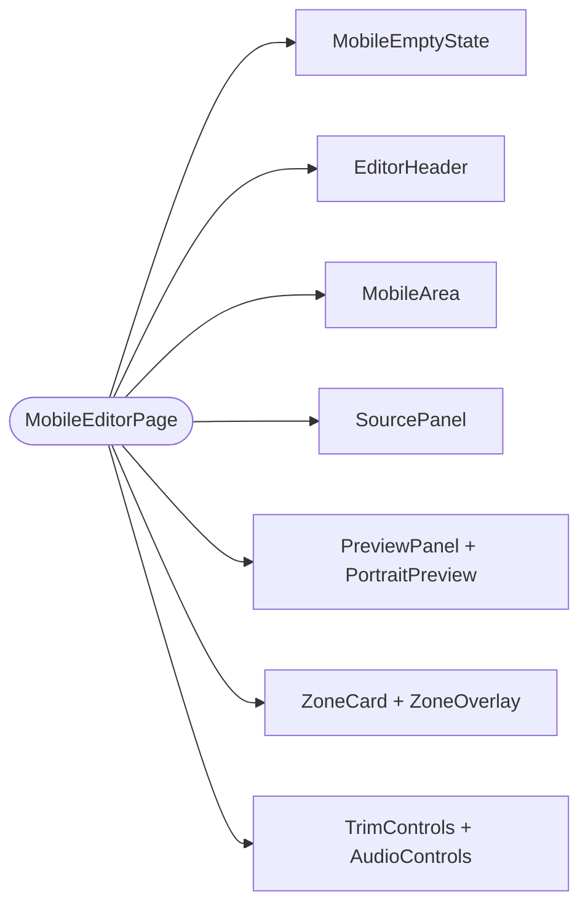
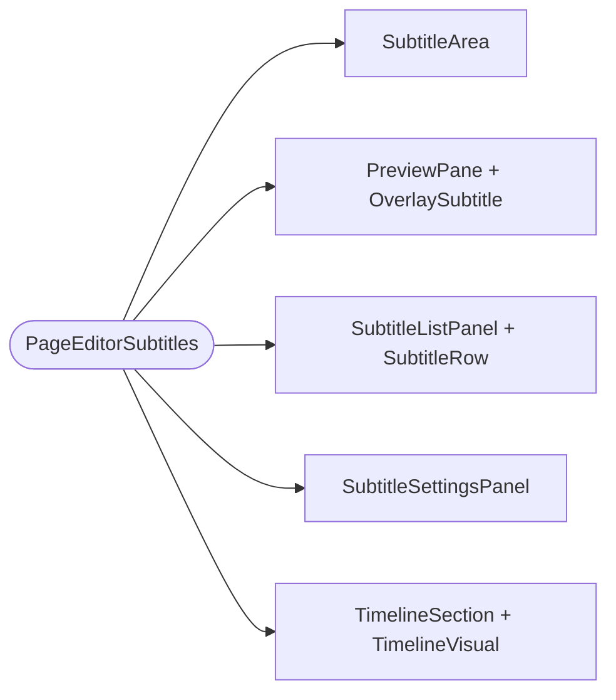
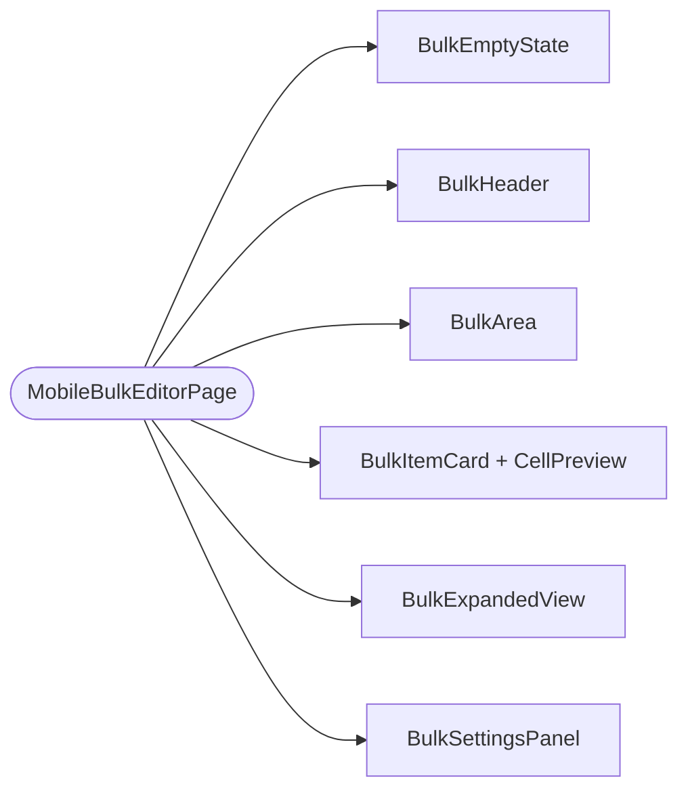
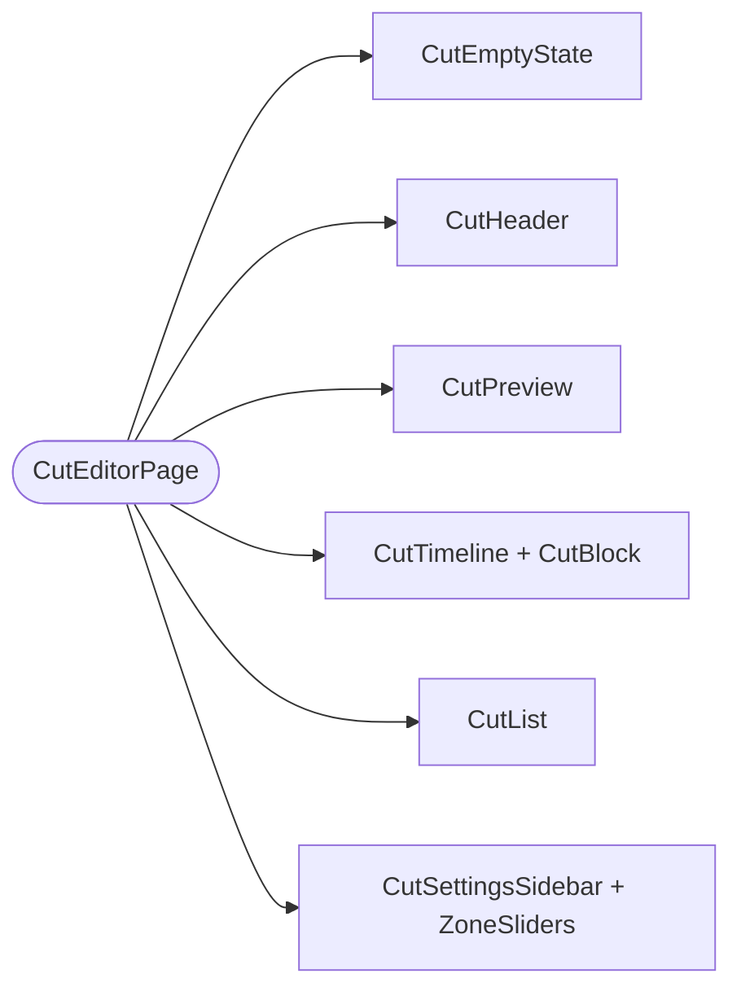
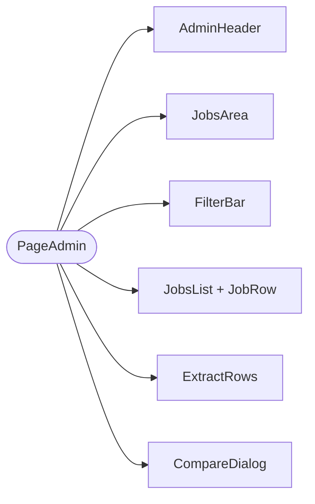
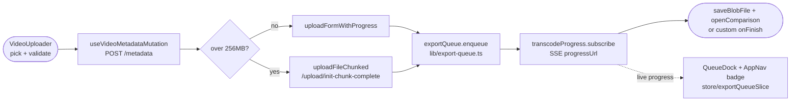

# FFmpeg Editor Web (`apps/web`)

Local-only Next.js frontend (App Router, `next dev -p 3050`). All pages are
`"use client"`. Server state = TanStack Query, sync UI state = TanStack Store.
Backend: `http://localhost:3100` (see `apps/api/README.md`).
Shared code: `@repo/contracts`, `@repo/types`, `@repo/ffmpeg-filters`, `@repo/ui`.

## 1. System overview

Two views: app shell (A) and data layers (B).

**A. Shell — every page renders inside this:**



**B. Where frontend code lives (same view as API §2):**



Nav order (`components/view-transition/AppNav.tsx`, `NAV_ITEMS`):
`/editor/crop` → `/editor/mobile` → `/editor/mobile/subtitles` →
`/editor/mobile/bulk` → `/editor/cut` → `/admin`. `/` redirects to
`/editor/crop` (`app/page.tsx`).

## 2. Pages — features and components

**`/editor/crop` — `PageEditorCrop`** (generic trim/crop/filter export):



- `CropEmptyState` — no-video dropzone (`VideoUploader` + picker).
- `CropEditorHeader` — filename + export entry.
- `CropWorkspace` — grid shell + `UploadProgress` banner.
- `CropArea` / `CropOverlay` — crop control/readout bar + canvas rect.
- `VideoPlayer` (`DynamicVideoPlayer` lazy) + `PlayerControls` — preview with
  CSS filter preview + audio preview.
- `Sidebar` — export form (format/fps/crf/speed, presets via
  `lib/export-presets.ts`, validation via `lib/validate-settings.ts`).
- `TrimControls`, `VisualFiltersPanel`, `AudioControls`, `AudioWaveform`,
  `VideoUploader`, `UploadProgress` — as named.

**`/editor/mobile` — `MobileEditorPage`** (16:9 → 9:16):



- State: `useMobilePageState` (layout/selection/playback/validation),
  export: `useMobileExport` → `exportQueue.enqueue` (`POST /api/transcode/mobile`
  via the export queue).
- `MobileArea` — control/readout surface; `SourcePanel` — source + zone stage;
  `PreviewPanel`/`PortraitPreview` — split slider + 1080×1920 renderer;
  `ZoneCard`/`ZoneOverlay` — per-zone x/y/w/h sliders; `SourceStage` — canvas.
- Shared layout persisted via `hooks/useSharedMobileLayout.ts`.

**`/editor/mobile/subtitles` — `PageEditorSubtitles`** (9:16 + burned text):



- State: `useSubtitleEditor` (`components/editor/subtitles/useSubtitleEditor.ts`);
  export → `POST /api/transcode/mobile/subtitles`.
- Panels: `SubtitleBasicsPanel`, `SubtitleFontPanel` (+ `GoogleFontPicker`),
  `SubtitleOutlinePanel`, `SubtitleShadowPanel`, `SubtitleBackgroundPanel`;
  placeholders in `placeholders.tsx`, lazy chunks in `heavy-modules.tsx`.

**`/editor/mobile/bulk` — `MobileBulkEditorPage`** (folder batch):



- State: `useBulkEditorState` (`components/editor/bulk/hooks.ts`);
  export: `useBulkExport` submits every selected file to `exportQueue.enqueue`
  (`POST /api/transcode/mobile`) at once — per-item rows mirror queue
  progress and finished files save via directory handle.

**`/editor/cut` — `CutEditorPage`** (multi-cut assembly):



- Hooks (colocated `components/editor/cut/`): `useCutList` (CRUD +
  sorted/overlap/outDuration), `useCutPlayback`/`useSeekTo` (cut-aware player),
  `useCutLayouts` (stacked/single + watermark), `useCutExport`/`useExportName`
  → `POST /api/transcode/cut`.

**`/admin` — `PageAdmin`** (jobs dashboard):



- State: `useAdminJobs` (`components/admin/useAdminJobs.ts`) — jobs query +
  SSE live sync + download/retry/rename/delete/cancel/clear actions.
- `JobsArea` — totals/queue readout; `FilterBar` — status filter;
  `JobRow` — badge/progress/row actions; `ExtractRows` — audio-extract history;
  `CompareDialog` (`components/export/CompareDialog.tsx`) — source-vs-output.

## 3. Data flow (every export takes this path)



- `lib/upload-chunked.ts`: `shouldUseChunked`, `uploadFileChunked`,
  `uploadFormWithProgress`, `CHUNKED_THRESHOLD_BYTES`.
- `lib/export-queue.ts`: `ExportQueue` class service (`exportQueue` singleton)
  — `enqueue` (fire-and-forget upload → job POST → SSE → download/save;
  429 retry, in-flight gate, orphan guard), `cancel`, `dismiss`.
  Progress mapping: upload 0–50, queued 50,
  processing 50–95, saving 97, completed 100.
- `lib/transcode-progress.ts` (`TranscodeProgress` service:
  `transcodeProgress.subscribe` (SSE subscriber
  with reconnect) + `awaitCompletion` (promise wrapper, admin use)).
- `lib/transcode-jobs.ts` (`TranscodeJobs` service:
  `transcodeJobs.cancelTranscodeJob/serverErrorMessage`), `parseRetryAfterMs`,
  `TranscodeHttpError`, `queuedLabel`, `withLogTail`.
- `store/exportQueueSlice.ts` + `components/export/QueueDock.tsx`: queue rows,
  dock pill/panel (`QueueDock`), nav widgets — `QueueActivityNav` (expanded
  nav, click toggles the dock) / `QueueActivityBadge` (collapsed nav, opens).
- `lib/preflight.ts` (`Preflight` service:
  `preflight.check/probeApiConnectivity`).
- `lib/export-history.ts` (`ExportHistory` service:
  `exportHistory.renameJob/retryEntry/openComparison/retryAudioExtract`) +
  `store/exportHistorySlice.ts`: `trackHistoryEntry`.

## 4. State map

```mermaid
flowchart LR
    subgraph Client["TanStack Store (sync)"]
        SRC[sourceSlice<br/>file, mediaUrl, trim]
        CROP[cropSlice<br/>crop, aspect, zoom]
        CUT[cutSlice<br/>format, fps, quality]
        FIL[filterSlice<br/>visual filters]
        AUD[audioSlice<br/>gain, fades, mutes]
        SUB[subtitleSlice<br/>subtitles, selection]
        MOB[mobileSlice<br/>loop flag]
        HIS[exportHistorySlice<br/>entries]
        CMP[compareSlice<br/>compare dialog]
        EQ[exportQueueSlice<br/>queue rows, dock]
    end
    subgraph Server["TanStack Query (async)"]
        MD[POST /metadata]
        AA[POST /audio/analysis]
        TR[POST /transcode*]
        JB[GET /transcode/jobs + SSE]
    end
    Client --> Server
```



- `providers.tsx`: `QueryClientProvider` (`staleTime` 5 s, no refocus),
  `hydrateSourceStore` + `subscribeToTrimPersistence` on mount, global
  `CompareDialog` + `QueueDock` + `CommandHost` (⌘K `CommandPalette` +
  `useGlobalShortcuts`; transport via `lib/playback-bus.ts`).
- Shared UI: `components/ui/*` (Shadcn: button, dialog, slider, select,
  sonner `Toaster`, tooltip…), `providers/ThemeProvider.tsx`,
  `components/ui/ThemeToggle.tsx`.

## 5. Local development

```bash
cd apps/web
bun install
bun run dev        # next dev -p 3050 (Turbopack)
bun run typecheck  # tsc --noEmit
bun run lint       # eslint
```

Needs the API on `:3100` (`NEXT_PUBLIC_API_URL` override); `/admin`
`JobsArea` shows the API base + queue so a wrong URL is obvious.
